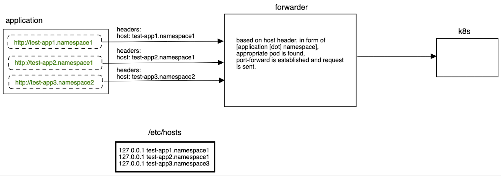

## about
It's a toy implementation of bindless port-forwarder written in Java (it even kinda works).
Bindless means, there is no socket bound on host's side, we are directly pushing to websocket connected to k8s api.
Because of that, single port (in our case: 80) can handle multiple request to different hosts (application in k8s).

## how to build
We need JDK 21+
```
export JAVA_HOME=/Users/.../jdk-21.0.1+12/Contents/Home
./gradlew shadowJar   
```

Let's run
```
sudo $JAVA_HOME/bin/java -Dkubeconfig=/Users/kubeconfigs/kubeconfig.yaml -jar build/libs/bindlessk8sforwarder.jar
```

to forward traffic to appropriate POD. Sudo is required because of http is running on port 80.
When forwarder is running, you can curl using kube-dns entries (curl -X GET http://your-app.namespace)

To make forwarder working, you need to add necessary entries in /etc/hosts. To handle following request:
```
curl http://test-app1.namespace1/some/resource
```
add
```
127.0.0.1 test-app1.namespace1
```
in /etc/hosts

## how it works
basically that is how it works

